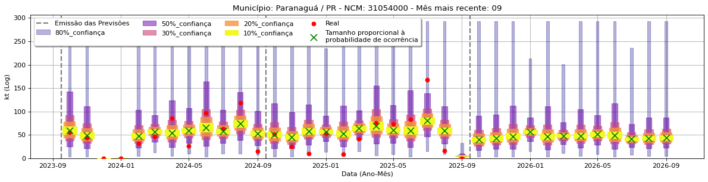

#  [QuantImport](https://quantimportbrazil.github.io/Sobre/)

---

# Fator mais Importante — Demonstração

> **Emissão:** 09-2025  
> O nosso sistema de aprendizado de máquinas (ML) não somente faz as previsões como permite que se liste e quantifique a importância dos fatores que a aferaram.  

**[Home](https://quantimportbrazil.github.io/Sobre/)**  

---

Para demonstrar a importância dos fatores nas previsões foi escolhida a previsão demonstrativa de maior variação percentual, e essa foi a do produto NCM 31054000 no município de Paranaguá-PR, no mês de Setembro (9), de 20025 para 2026, que se pode observar a seguir:

No mês 09 de 2025, note que:  
* Não esta presente a marcação com "X" verde no centro da previsão. Isso indica que o nosso sistema prevê que essa determinada importação provavelmente não ocorrerá.
* A previsão quantitativa foi de aproximadamente 5 kt. isso indica que o nosso sistema prevê que, se a importação ocorrer, será de aproximadamente 5 kt.

No mês 09 de 2026, note que:
* O "X" verde ao centro tem máximo tamanho, indicando que o nosso sistema prevê que a importação provavelmente ocorrerá.
* A previsão quantitativa é de aproximadamente 50 kt. 

Nosso sistema proprietário indicou que vários fatores causaram essa grande mudança percentual. Ele também indicou que o fator mais influente neste caso foi a intensa queda nas importações da região de Barreiras/BA. Essa desaceleração pode ser vista no gráfico a seguir:

Isso é um exemplo da importância de se analisar conjuntamente todos os dados do Brasil, mesmo em municípios distantes e não abastecidos diretamente pelo município que esta sendo previsto!

---

## Notas Técnicas
* `*` Mesmo os valores aqui considerados reais são estimativas de nosso sistema, pois os dados divulgados não apresentam tal granularidade.  
* Formato das saídas: importância relativa dos fatores (scores) e, quando aplicável, séries temporais com intervalos de confiança.  
* A imagem acima (fator_mais_importante.png) está salva neste repositório; mantenha o nome e a capitalização exatos.

---

## Contato
**André Coutinho Bueno**  
Cientista de Dados e Fundador  
[andre.bueno@quantimport.com.br](mailto:andre.bueno@quantimport.com.br)
